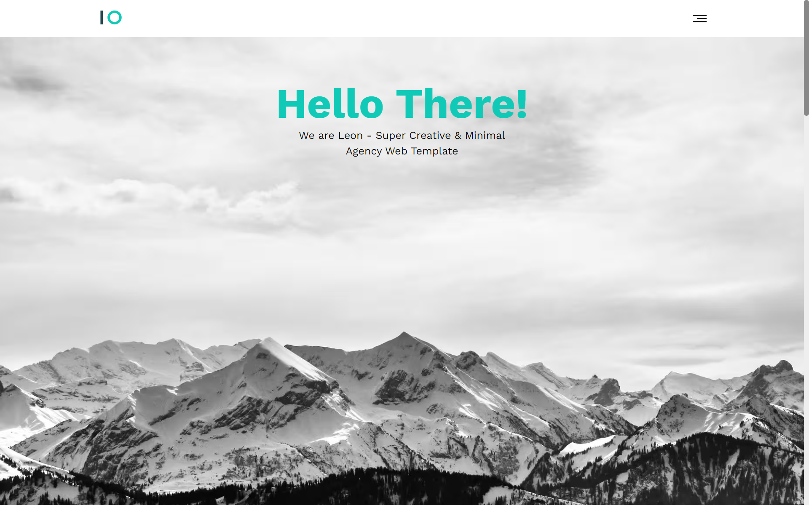

# Leon Template

Demo Link: https://ahmedhanye.github.io/Leon-Template/

Leon Template is a super creative and minimal agency web template designed to showcase your portfolio and highlight your creative services. This project is a single-page HTML template with a responsive design, suitable for agencies, freelancers, and creative professionals.

## Features
Leon Template comes with the following features:

- Super creative and minimal design.
- Responsive layout for optimal viewing on various devices.
- Navigation menu for easy access to different sections.
- Home section with a greeting and introduction.
- Features section highlighting key aspects of the service.
- Services section showcasing graphic design, UI & UX, web design, and web development.
- Portfolio section displaying various projects with images and descriptions.
- About section providing information about the creative agency.
- Contact section with contact details and social network links.